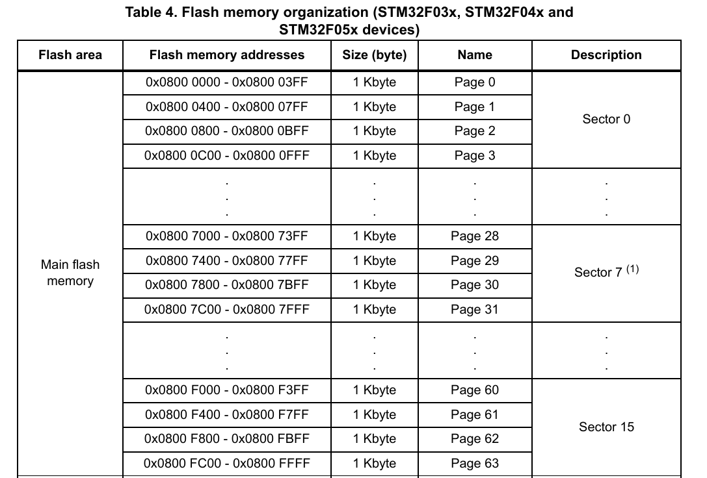

## Flash Programming

* STM32F0 embedded flash memory can be programmed in 2 different methods:
1. ***In-Circuit Programming***: This method is used to update the entire contents of the flash memory, using the SWD protocol or the boot loader to load the user application into the microcontroller. ICP offers quick and efficient design iterations and eliminates unnecessary package handling or socketing of devices.

2. ***In-Application Programming***: can use any communication interface supported by the microcontroller (I/Os, USB, CAN, USART, I2C, SPI, etc.) to download programming data into memory. IAP allows the user to re-program the flash memory while the application is running. Nevertheless, part of the application has to have been previously programmed in the flash memory using ICP.
The program and erase operations can be performed by below registers:
 • Key register (FLASH_KEYR)
 • Option byte key register (FLASH_OPTKEYR)
 • Flash control register (FLASH_CR)
 • Flash status register (FLASH_SR)
 • Flash address register (FLASH_AR)
 • Option byte register (FLASH_OBR)
 • Write protection register (FLASH_WRPR)

 *Note*: For program and erase operations on the flash memory (write/erase), the internal RC oscillator (HSI) must be ON

#### Main Flash Memory Organization in STM32F0:

<br>

As seen above, the Main flash memory is devided into 16 secotrs with each sector of 4KB size. We will make use of sector 15 since code and other program setting will be starting from lower address(0x08000000). 

### Unlocking the Flash Memory

After reset, the flash memory is protected against unwanted write or erase operations. The **FLASH_CR** register is not accessible in write mode, except for the **OBL_LAUNCH** bit, used to reload the option bits. An unlocking sequence should be written to the **FLASH_KEYR** register to open the access to the FLASH_CR register. This sequence consists of two write 
operations:
 • Write KEY1 = 0x45670123
 • Write KEY2 = 0xCDEF89AB

``` C
    while(((FLASH->SR) & (FLASH_SR_BSY))){}     /* Check that no main flash memory operation is ongoing. Busy Flag*/
    if((FLASH->CR & FLASH_CR_LOCK)!=0){         /* Write to 1 only. When it is set, it indicates that the flash is locked*/
        /* Flash Key Register: Unlock keys*/
        FLASH->KEYR = 0x45670123;
        FLASH->KEYR = 0xCDEF89AB;
    }
```

NOTE:   1. Any wrong sequence locks up the *FLASH_CR* register until the next reset.<br>
        2. In the case of a wrong key sequence, a bus error is detected and a Hard Fault interrupt is generated
        3. The *FLASH_CR* register can be locked again by user software by writing the *LOCK* bit in the *FLASH_CR* register to 1
        4. The main flash memory can be programmed 16 bits at a time
        5. The flash memory can be erased page by page or completely (mass erase)

### Flash Memory Erase sequence

To erase a page, the procedure below should be followed:

1. Check that no flash memory operation is ongoing by checking the BSY bit in the FLASH_CR register.
2. Set the PER bit in the FLASH_CR register.
3. Program the FLASH_AR register to select a page to erase.
4. Set the STRT bit in the FLASH_CR register (see note below).
5. Wait for the BSY bit to be reset.
6. Check the EOP flag in the FLASH_SR register (it is set when the erase operation has succeeded).
7. Clear the EOP flag.

``` C
        while(((FLASH->SR) & (FLASH_SR_BSY))){}     /* Check that no main flash memory operation is ongoing. Busy Flag*/
        // Clear any pending error flags and EOP before starting a new operation
        FLASH->SR = FLASH_SR_EOP | FLASH_SR_PGERR | FLASH_SR_WRPERR;
        FLASH->CR |= FLASH_CR_PER;          // Set Page Erase command
        FLASH->AR = 0xF000;      // Write the address of the page to be erased
        FLASH->CR |= FLASH_CR_STRT;         // Start erase operation
        while(((FLASH->SR) & (FLASH_SR_BSY))){} 
        while(!(FLASH->CR & FLASH_CR_PER));
                FLASH->CR &= ~FLASH_CR_PER;             // Clear PER bit after each page erase
```

### Flash Memory Write sequence

1. Check that no main flash memory operation is ongoing by checking the BSY bit in the FLASH_SR register.
2. Set the PG bit in the FLASH_CR register.
3. Perform the data write (half-word) at the desired address.
4. Wait until the BSY bit is reset in the FLASH_SR register.
5. Check the EOP flag in the FLASH_SR register (it is set when the programming operation has succeeded), and then clear it by software

``` C
    while(((FLASH->SR) & (FLASH_SR_BSY))){}     /* Check that no main flash memory operation is ongoing. Busy Flag*/
    FLASH->CR |= FLASH_CR_PG;                   /* Programming Bit*/
    Flash_User_Data_Addr = Data;
    while(((FLASH->SR) & (FLASH_SR_BSY))){}     /* Wait until the BSY bit is reset. Busy Flag*/
    while(!((FLASH->SR) & (FLASH_SR_EOP))){}    /* Set by hardware when a flash operation (programming / erase) is complete*/
```   
