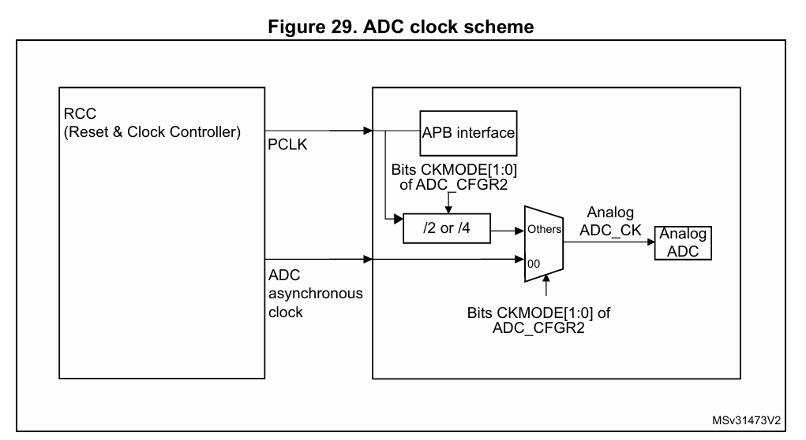

# Analog To Digital Converter (ADC) :

### Aim of this Project : 
Configure the ADC in polling method, serial print the values to the console.

Features of STM32F0 ADC:

1. Up to 16 channels (external inputs, internal temperature sensor, and voltage reference).
2. Configurable resolution (12, 10, 8, or 6 bits).
3. Single or continuous conversion modes.
4. Software or hardware (timer, external pin) conversion triggers.
5. Right or left data alignment.
6. Interrupt or DMA support for conversion results.
7. Programmable sampling time per channel.
8. Calibration for improved accuracy.

### Setting up the ADC Peripheral :

1. Enable the ADC Clock. Controller Supports 2 method for ADC Clocking, Synchronous and Asynchronous(HSI - 14MHz). We'll be using HSI14 clock. 

<br>

```C
    ADC1->CFGR2 &= ~ADC_CFGR2_CKMODE;               // Asynchronous clock(ie internal HSI14 clock)
    RCC->CR2 |= RCC_CR2_HSI14ON;                    // Enable HSI14 Clock(14MHz)
    while(!((RCC->CR2) & (RCC_CR2_HSI14RDY)));      // wait for HSI14 Clk to be ready
    RCC->APB2ENR |= RCC_APB2ENR_ADC1EN;             // Enable ADC1 Clock
```

2. Factory Calibration: On every STM controller, the ADC is calibrated in manufacturing process, which makes user to proceed without considering need to calibrate. 

```C
    ADC1->CR|= ADC_CR_ADCAL;                /* Start ADC calibration */
    while(((ADC1->CR)&(ADC_CR_ADCAL))!=0);  /* Wait for hardware to clear ADCAL after calibration */
```

3. Set the required settings for the ADC. 

```C
    ADC1->CR &= ~ADC_CR_ADEN;               /* Disable ADC */
    ADC1->CFGR1 = 0;                        /* Right aligned, 12 bit resolution*/
    ADC1->CFGR2 = 0;                        /* Asynchronous clock source */
    ADC1->CHSELR |= ADC_CHSELR_CHSEL1;      /* Select the Channel 1- PA1 */
    ADC1->CR |= ADC_CR_ADEN;                /* Enable ADC*/
```

4. We will be reading the ADC channel in Polling mode.

```C
    ADC1->CR |= ADC_CR_ADSTART;             /* Start ADC conversion */
    while(!((ADC1->ISR)&(ADC_ISR_EOSMP)));  /* End of sampling, wait for sampling to be over */
    return (ADC1->DR);                      /* Return conversion result */
```