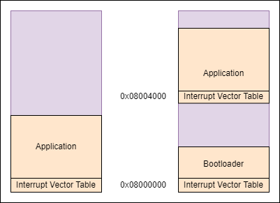
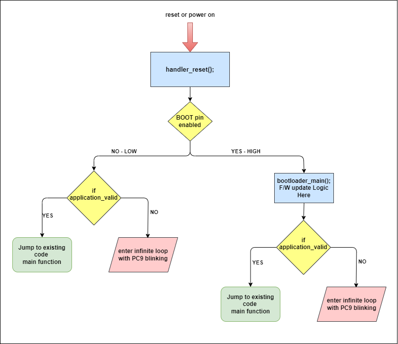
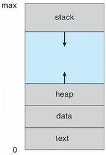

# Bootloader

### A. Aim of this Project:
* To create simple Bootloader, In which one of the pins(PA0) in controller will be defined as Boot Pin and if it is enabled HIGH, then the controller will enter into Boot Mode, if else then execute whatever application code is present.

### B. What is Bootloader and it's use

* Bootloader is a short program that runs another program, mainly bootloader code to application code. It helps to initialize hardware, creating a backup(if main application code gets corrupted), updation of software.<br>

* The bootloader size should be as small as possible, since bootloader also resides in the same memory region as application does, so less bootloader size, more space for application code.<br>

### C. Challenges:

1. Absence of VTOR in CM0 & CM0+ controllers: STM32F0 which is a ARM Cortex-M0 based chip, the Cortex-M0 doesn'nt have VTOR(Vetor Table Offset Register), which helps to relocate the vector table from it's default location(0x08000000) to other desired location, this makes design of Bootloader in such controller little tricky.<br>

<br>

2. Issue with Interrupts in existing design: If we follow the above design, after reset the program will enter into bootloader section(0x08000000), it'll define vector table and bootloader code in that memory and jump into application code region(0x08004000), In application code region also, there will be vector table defined and without any problems the control will be transferred from bootloader code to application code. The real problem occurs when any interrupt occurs, then the control will be tranferred to bootloader vector table, not with the application vector table. This results in undefined outputs.<br>

### D. Solution: 

<br>

1. Bootloader Vector Table(Flash @ 0x08000000) -- COPY --> Bootloader Vector table(RAM @ 0x20000000)
2. Remap 0x20000000 (SRAM) to 0x00000000 using SYSCFG, From this point on, the CPU sees the bootloader's RAM based Vector table at 0x00000000
3. Application Vector table(Flash @ 0x08004000) -- COPY --> Application vector table(RAM @ 0x20000000). This overwrites the bootloader's vector table in RAM. Since 0x20000000 is still remapped to 0x00000000, the CPU now sees the application's RAM based vector table at 0x00000000
4. Set MSP to application's Stack pointer
5. Jump to application's Reset Handler

## E. Bootloader Design steps
### Ⅰ. Bootloader Linker script - bootloader.ld

1. Separate application and bootloader memory area in linker script. Here out of 64K of Flash memory, we are utilizing only 16K for bootloader<br>
```
MEMORY
{
    BOOTROM  (rx)   : ORIGIN = 0x08000000, LENGTH = 16K
    RAM      (rwx)  : ORIGIN = 0x20000000, LENGTH = 8K
}
```
2. The ***SECTIONS*** remains same as of application code linker script.

### Ⅱ. STM32_Bootloader.c or startup code for Bootloader

1. Copy *.data* section from Flash to RAM, Zero-fill *.bss* section in RAM<br>
2. Enable SYSCFG clock (CRITICAL for memory remapping)<br>
3. Copy Bootloader's Vector Table from Flash (0x08000000) to RAM (0x20000000), The bootloader's vector table is initially loaded at 0x08000000<br>
```C
    volatile uint32_t *boot_flash_vec_table = (volatile uint32_t*)0x08000000;
    volatile uint32_t *ram_vec_table_ptr = (volatile uint32_t*)RAM_VECTOR_TABLE_ADDR; // RAM_VECTOR_TABLE_ADDR = 0x20000000

    for (int i = 0; i < VECTOR_TABLE_SIZE_WORDS; i++) {
        ram_vec_table_ptr[i] = boot_flash_vec_table[i];
    }
```
4. Remap SRAM to address 0x00000000 using SYSCFG_CFGR1.MEM_MODE, Now the system will fetch its vector table from RAM_VECTOR_TABLE_ADDR (0x20000000), Any interrupts from here on will use the RAM-based bootloader table. Any access to address 0x00000000 (including interrupt vector fetches) will actually resolve to 0x20000000 (the start of your RAM). This means your bootloader's active vector table is now the copy you placed at 0x20000000 in RAM
```C
    SYSCFG->CFGR1 &= ~(3<<0); // Clear MEM_MODE bits (0b11)
    SYSCFG->CFGR1 |= (2<<0); // Set MEM_MODE to SRAM (0b10)
```
5. If boot pin is enabled, then jump to bootloader_main() function to receive new firmware, or else fallback to default application code present in the memory.
```C
    // Copy Application's Vector Table from Flash (APPLICATION_START_ADDR) to RAM (RAM_VECTOR_TABLE_ADDR)
    volatile uint32_t *app_flash_vec_table = (volatile uint32_t*)APPLICATION_START_ADDR;
    // ram_vec_table_ptr is already pointing to RAM_VECTOR_TABLE_ADDR (0x20000000)
    for (int i = 0; i < VECTOR_TABLE_SIZE_WORDS; i++) {
        ram_vec_table_ptr[i] = app_flash_vec_table[i];
    }
```
You are now taking the application's vector table (which lives in Flash at 0x08004000) and copying it into the same RAM location (0x20000000) where the bootloader's vector table used to be. Since SRAM is still remapped to 0x00000000, the CPU will continue to fetch its vector table from 0x00000000 (which is now pointing to your application's vector table at 0x20000000 in RAM). This allows the application to use its own interrupt handlers
6. Before updating the existing code or fallback to default application code, secure mechanisam to detect whether the application code is valid or not, if not, safely enter into infinite loop with indication through LED blinks.

***NOTE***

The Stack grows downwards(Higher memory address to lower) and Heap grows upwards(Lower memory address to Higher memory address)<br>

<br>