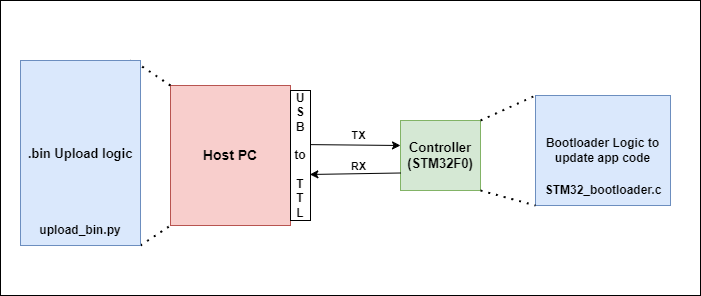
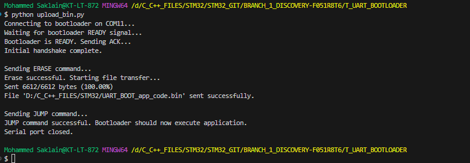

## Aim of this Project: 
To upgrade the Existing application code with the Bootloader, app code will be received by the .bin file over UART after entering into bootmode, the received .bin file over UART should be verified with some checksum mechanism.

### To-DO

<br>


1. UART initialization in Boot code<br>
2. Simple Communication mechanism to send .bin file over Host(Computer) to the Target(uC), in which data format, data correctness and acknowledgement mechanism has to build.
3. To erase the Flash memory in Controller, it's technique and implementation
4. Validate the received program and jump to the new application code area.

### UART Communication protocol structure at Controller End :

1. Start Byte : Indicates the start of the packet
2. Command Code(ERASE, WRITE, JUMP): Command to be processed at controller end, ERASE & WRITE Flash Memory, JUMP to the application code.
3. Data Length : Length of the Data packet
4. Actual Data : Send the actual Data
5. Checksum : Simple Checksum from Command to the Actual Data
5. End Byte : To represents the end of the communication packet.

* Constants and Pakcet sizes : 

| Pakcet | Size(bytes) | Description |
|---|---|---|
| START_BYTE | 1 | Start Byte (0x01) |
| CMD | 1 | Command (ERASE(0x03), WRITE(0x04), JUMP(0x05))
| LEN | 1 | Data Length |
| DATA | 20 | Data |
| CheckSum | 1 | Simple sum from CMD to DATA |
| END_BYTE | 1 | End Byte(0x02) | 
| ACK | 1 | 0xCC |
| NACK | 1 | 0xEE | 


* Example ***Write*** Packets
```
    [0x01][0x04][LEN][DATA0][DATA1]...[DATALEN-1][CHECKSUM][0x02]
```
* Example ***ERASE*** Packets
```
    [START_BYTE][CMD] [LEN][DATA][CHECKSUM][END_BYTE]
    [0x01]      [0x03][0x1][0x20][0x24]    [0x02]
```

### Host side mechanism to send .bin file over UART

The python script "upload_bin.py" performs below sequence of operations to flash new application code to the controller :

1. ***Establish a Connection :*** Connects to the STM32 bootloader via UART.
2. ***Handshake :*** Ensure both the host and controller device are ready with simple "READY" and "ACK" sequence.
3. ***Erase Old Firmware :*** Sends a command to the bootloader to erase the old application residing in the microcontroller's flash memory.
4. ***Transfer New Firmware :*** Reads a new application(a .bin file) piece by piece and sends each chunk to the bootloader, the bootloader then writes these chunks to the flash memory.
5. ***Jump to New Firmware :*** Once all data is transferred, it sends a command to the bootloader to "JUMP" and start executing the newly flashed application.

### Working : 

1. Mention correct COM port Number and application .bin file location in Host side Python script. 
2. Run python scirpt. Hold reset Button and then press Boot pin(PA0), leave first reset and then boot pin at controller part. The Communication should start now between Host and the controller.
3. After successfull operation, the output console will look like this and the application code should now be executing.

<br>