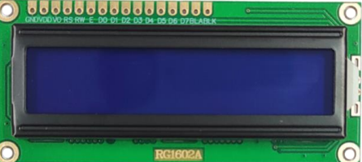

# 16x02 LCD - RG1602A - 8 Bit Mode of Operation  

 

## Pin Connection  

| Pin Name | Description |
|---|---|
| VSS | Ground |
| VDD | Power Supply(+5V) |
| VEE | Contrast Control |
| RS  | RS  = 0 to select Command Register   RS  = 1 to select Data Register |
| R/W | R/W = 0 for Write   R/W = 1 for Read |
|  E  | Enable Pin |
| D0-D7 | 8 Bit Data Bus |

## LCD Commands(RS)  

| RS Commands | Description |
|---|---|
| 0x01 | Clear Screen|
| 0x02 | Return Home |
| 0x06 | Increment Cursor|
| 0x0C | Display On, No cursor |
| 0x0F | Display On, Cursor Blink|
| 0x80 | Force Cursor to first line beginning|
| 0xC0 | Force Cursor to second line beginning|
| 0x38 | 8 bit mode |
| 0x28 | 4 bit mode |
| 0x18 | Cursor or Display Shift   0x18 - Left, 0x1C - Right |

